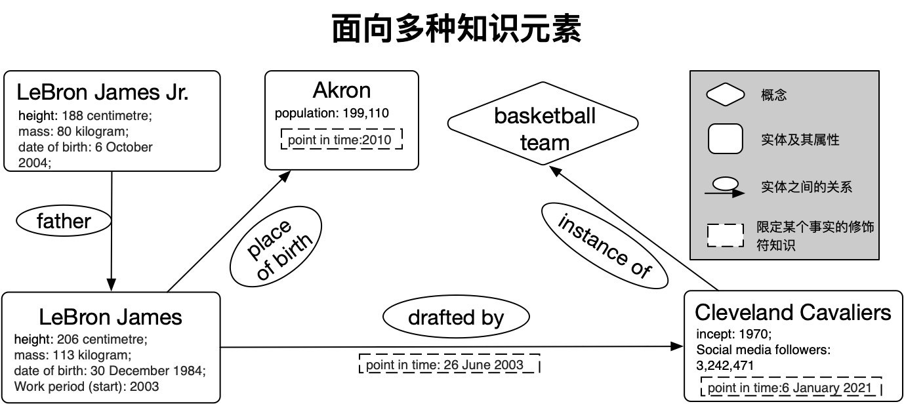

第一个KoPL程序
============

准备知识库
-----------------

目前，我们支持JSON格式的知识库，其形式为:

::

	{
		# 概念
		'concepts': {
			'id': {
				'name': '',
				'subclassOf': ['<concept_id>'],
			}
		},
		# 实体，确保与概念是不相交的
		'entities': {
			'id': {
				'name': '<entity_name>',
				'instanceOf': ['<concept_id>'],
				'attributes': [ 
					{
						'key': '<key>',
						'value': {
							'type': 'string'/'quantity'/'date'/'year'
							'value':  # quantity类型为float或int, year类型为int, date类型为'yyyy/mm/dd'
							'unit':   # 针对quantity类型，为str, 如'height'的unit可以是'centimetre', ‘population’的unit是‘1’
						},
						'qualifiers': {
							'<qk>': [
								<qv>, # 每个qv都是像'value'一样的字典，包括'type', 'value'和'int'
							]
						}
					}
				]
				'relations': [ 
					{
						'relation': '<relation>',
						'direction': 'forward' or 'backward',
						'object': '<object_id>',
						'qualifiers': {
							'<qk>': [
								<qv>, # 每个qv都是像'value'一样的字典，包括'type', 'value'和'int'
							]
						}
					}
				]
			}
		}
	}

例如，对于上图中的知识库，知识库为:

::

	example_kb = {
		'concepts': {
			'Q13393265': {
				'name': 'basketball team',
				'subclassOf': ['Q12973014'] 
			},
			'Q12973014': {
				'name': 'sports team',
				'subclassOf': []
			},
			'Q3665646': {
				'name': 'basketball player',
				'subclassOf': ['Q2066131']
			},
			'Q2066131': {
				'name': 'athlete',
				'subclassOf': []
			}
		},
		'entities': {
			'Q36159': {
				'name': 'LeBron James',
				'instanceOf': ['Q3665646'],
				'attributes': [
					{
						'key': 'height',
						'value': {
							'type': 'quantity',
							'value': 206,
							'unit': 'centimetre'
						},
						'qualifiers': {}
					},
					{
						'key': 'work period (start)',
						'value': {
							'type': 'year',
							'value': 2003
						},
						'qualifiers': {}
					},
					{
						'key': 'sex or gender',
						'value': {
							'type': 'string',
							'value': 'male'
						},
						'qualifiers': {}
					},
					{
						'key': 'date of birth',
						'value': {
							'type': 'date',
							'value': '1984-12-30'
						},
						'qualifiers': {}
					}
				],
				'relations': [
					{
						'relation': 'place of birth',
						'direction': 'forward',
						'object': 'Q163132',
						'qualifiers': {}
					}, 
					{
						'relation': 'drafted by',
						'direction': 'forward',
						'object': 'Q162990',
						'qualifiers': {
							'point in time': [
								{
									'type': 'date',
									'value': '2003-06-26'
								}
							]
						}
					},
					{
						'relation': 'child',
						'direction': 'forward',
						'object': 'Q22302425',
						'qualifiers': {}

					},
					{
						'relation': 'member of sports team',
						'direction': 'forward',
						'object': 'Q162990',
						'qualifiers': {
							'position played on team/speciality': [
								{
									'type': 'string',
									'value': 'small forward'
								}
							],
							'sport number': [
								{
									'type': 'quantity',
									'value': 23,
									'unit': '1'
								}
							]
						}
					}
				]
			},
			'Q163132': {
				'name': 'Akron',
				'instanceOf': [],
				'attributes': [
					{
						'key': 'population',
						'value': {
							'type': 'quantity',
							'value': 199110,
							'unit': '1'
						},
						'qualifiers': {
							'point in time': [
								{
									'type': 'year',
									'value': 2010
								}
							]
						}
					}
				],
				'relations': []
			},
			'Q162990': {
				'name': 'Cleveland Cavaliers',
				'instanceOf': ['Q13393265'],
				'attributes': [
					{
						'key': 'inception',
						'value': {
								'type': 'year',
								'value': 1970
						},
						'qualifiers': {}
					}
				],
				'relations': []
			},
			'Q22302425': {
				'name': 'LeBron James Jr.',
				'instanceOf': ['Q3665646'],
				'attributes': [
					{
						'key': 'height',
						'value': {
							'type': 'quantity',
							'value': 188,
							'unit': 'centimetre'
						},
						'qualifiers': {} 
					},
					{
						'key': 'sex or gender',
						'value': {
							'type': 'string',
							'value': 'male'
						},
						'qualifiers': {}
					},
					{
						'key': 'date of birth',
						'value': {
							'type': 'date',
							'value': '2004-10-06'
						},
						'qualifiers': {}
					}
				],
				'relations': [
					{
						'relation': 'father',
						'direction': 'forward',
						'object': 'Q36159',
						'qualifiers': {}
					}
				]

			}
		}

	}

KoPL编程问答
----------------------------

KoPL的实现基于python，此处演示一个示例。更多API请参考API文档
:doc:`7_kopl`，关于KoPL基本函数的介绍可以参考
:doc:`2_function`。

::

	from kopl.kopl import KoPLEngine
	from kopl.test.test_example import example_kb

	engine = KoPLEngine(example_kb)

	ans = engine.SelectBetween(
		engine.Find('LeBron James Jr.'),
		engine.Relate(
			engine.Find('LeBron James Jr.'),
			'father',
			'forward'
		),
		'height',
		'greater'
	)

	print(ans)

在这个示例里，我们查询LeBron James Jr.和他的父亲谁更高，KoPL程序给出了正确的答案: LeBron James！

更多KoPL样例请参考
:doc:`更多KoPL样例 <5_example>`。

